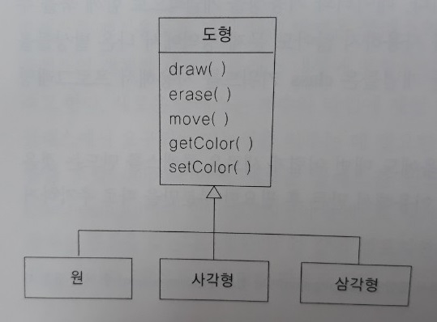
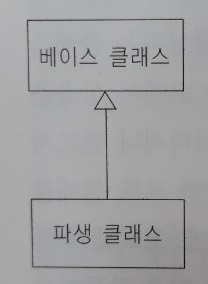
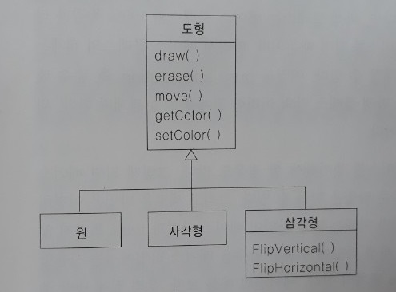
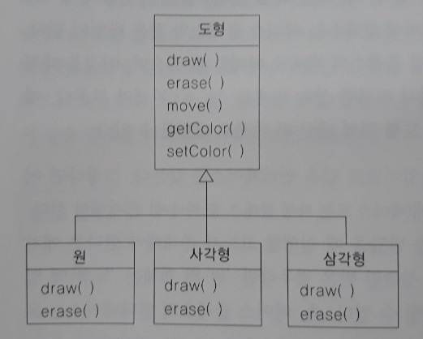
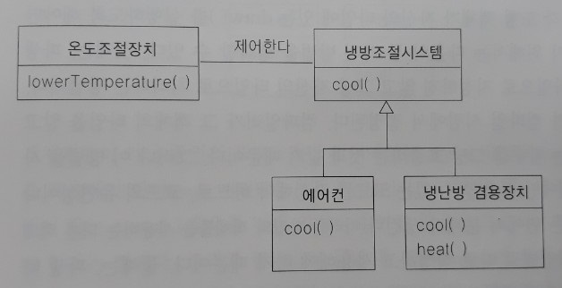

1장: 객체란?
=====
## 목차
1. [CONTENTS](#CONTENTS)
2. [참고](#참고)

## CONTENTS
* 객체란?
	* [추상화 과정](#추상화-과정)
	* [객체는 인터페이스를 갖는다](#객체는-인터페이스를-갖는다)
	* [객체는 서비스를 제공한다](#객체는-서비스를-제공한다)
	* [구현부분 감추기](#구현부분-감추기)
	* [구현부분의 재사용](#구현부분의-재사용)
	* [상속](#상속)
		* [Is-a와 Is-like-a 관계](#Is-a와-Is-like-a-관계)
	* [다형성의 개념과 구현](#다형성의-개념과-구현)

- - -
### 추상화 과정
모든 프로그래밍 언어에서는 추상화(abstraction)를 제공한다. 이는 우리가 해결할 수 있는 문제의 복잡도와 직접적인 관련이 있다.

* 추상화(abstraction)
	* 종류(kind): 추상화하려는 것이 무엇인가?
		* 프로그래밍 방법론 이전
			* 어셈블리어: 근간이 되는 컴퓨터를 추상화
			* 명령형(imperative) 언어(ex. Fortran, BASIC, C): 어셈블리어를 추상화
				* 어셈블리어에 비해 많이 진보했지만 여전히 추상화 수준이 낮아서 해결하려는 문제 구조보다는 여전히 컴퓨터 구조의 관점에서 생각 필요
					* 즉, 문제 모델(업무 영역)과 머신 모델(컴퓨터 영역) 간의 관계를 프로그래머가 만들어주어야 함
				* 이런 연관 작업에 대한 부분이 작성하기 어렵고 유지보수 비용이 많이 들어가기 때문에 프로그래밍 방법론 분야가 생겨남
		* 프로그래밍 방법론 이후
			* 머신 모델로 만드는 다른 방도(프로그래머가 직접 작성하지 않음)는 우리가 문제 모델을 만들면 프로그래밍 언어에서 머신 모델로 만들도록 하는 것
			* 초창기 언어들
				* 예
					* LISP: 모든 문제들이 궁극적으로 목록 구조라는 관점
					* APL: 모든 문제들이 알고리즘이라는 관점
					* PROLOG: 모든 문제들이 일련의 연속된 판단이라는 관점
				* 문제점
					* 이 접근법들은 특정 부류의 문제에 대해선 좋은 해법이 될 수 있음
					* 하지만 제약 기반(constraint-based)의 프로그래밍을 하기 위해 만들어졌으므로, 그 문제 영역을 벗어나면 부적합
			* 객체지향 접근방식
				* 문제 영역의 요소들을 프로그래머가 표현할 수 있도록 함
					* 표현 방법이 보편적이라 프로그래머는 특정 타입의 문제에 제한되지 않음
				* 객체(Object)
					* 문제 영역의 요소들 및 그것을 해결 영역에 표현한 것을 총칭
					* 문제 영역에 대응되는 객체 없이 해결 영역에만 존재하는 객체도 필요
				* OOP
					* 아직은 컴퓨터와 관련되지만 해법이 실행된 컴퓨터의 관점이 아닌 문제의 관점
						* 즉, 각 객체는 마치 컴퓨터(상태와 오퍼레이션을 가짐)처럼 보임
							* 오퍼레이션(operation): 외부의 요청으로 수행하는 일
	* 특성(quality)

아래는 앨런 케이가 요약한 최초의 성공적 객체지향 언어인 스몰토크(smalltalk)의 다섯 가지 기본 특성이다. 이는 객체지향 프로그래밍에 대한 기본 원리를 나타낸다.

* 모든 것이 객체다:
	* 객체를 변수라고 생각하자. 데이터를 저장한다.
	* 그러나 우리는 객체에게 '요청(request)'을 하여 객체 자신이 갖는 오퍼레이션을 수행하도록 요구할 수 있다.
* 프로그램은 여러 가지의 객체들로 구성되고, 각 객체들은 상호간에 메시지를 보내어 일을 수행한다:
	* 객체에게 일을 요청하려면 '메시지를 보낸다'.
	* 더 구체적으로 말하면 객체가 갖는 메소드(method)를 호출하는 것을 메시지라고 생각할 수 있다.
* 각 객체는 다른 객체들로 이루어진 자신의 메모리를 갖는다:
	* 달리 말해서, 기존 객체들을 포함시켜 새로운 종류의 객체를 만든다.
	* 따라서 포함된 객체들의 단순화로 복잡함을 감추게 되므로 복잡도가 높은 프로그램을 만들 수 있다.
* 모든 객체는 자신의 타입(type)이 있다:
	* 객체는 클래스(class)의 인스턴스(instance)이다.
	* 여기서 '클래스'는 '타입'과 같은 의미이다.
	* 클래스를 특징짓는 가장 중요한 것은 '그 클래스에게 무슨 메시지를 보낼 수 있는가?' 즉, 무슨 일을 할 수 있는가이다.
* 특정 타입에 속하는 모든 객체는 동일한 메시지를 받을 수 있다:
	* '원(circle)' 타입의 객체는 또한 '도형(shape)' 타입의 객체이므로, 특정 원 객체는 도형의 메시지를 받을 수 있다.
	* 도형 객체들에게 메시지를 보내면 자동적으로 도형 부류에 적합한 어떤 일을 처리하는 코드를 작성할 수 있다는 의미이다.
	* 이것을 '대체성(substitutability)'이라고 하며, OOP의 가장 강력한 개념 중 하나이다.

Grady Booch는 훨씬 더 간결하게 객체를 기술하고 있다.

> 객체는 상태(state)와 행동(behavior) 및 정체성(identity)을 갖는다.

즉, 객체는 내부 데이터(상태로 되는)와 메소드(행동을 수행하는)를 가질 수 있으며, 각 객체는 모든 다른 객체와 고유하게 식별될 수 있다(구체적으로 말해서 각 객체는 고유한 메모리 번지를 갖는다)는 의미이다. 추가로 고유한 메모리 번지라는 표현은 다소 제한적이다. 왜냐하면 객체들이 서로 다른 컴퓨터와 번지 공간에 존재할 수 있으며, 디스크에 저장될 수도 있기 때문이다. 이 경우 객체의 정체성은 메모리 번지가 아닌 다른 것으로 결정되어야 한다.
	
##### [목차로 이동](#목차)

### 객체는 인터페이스를 갖는다
* class 키워드
	* 모든 객체는 고유하면서도 또한 공통적인 특성과 행동을 갖는 특정 클래스에 속함
	* 프로그램 실행 중에 상태만 변할 뿐 동일한 객체들은 '객체의 클래스'로 분류하였는데, 바로 여기서 class 키워드가 도입
		* 이러한 개념은 최초의 객체지향 언어인 [Simula-67](#Simula-67)에서 그대로 사용
* 추상 데이터 타입(클래스) 만들기: OOP의 기본 개념
	* 추상 데이터 타입은 내장 타입(built-in type)과 거의 똑같이 동작
	* 즉, 추상 데이터 타입의 변수를 생성(A)하여 조작(B)할 수 있음
		* A: 객체지향 용어로 객체 또는 인스턴스라고 함
		* B: 메시지나 요청을 보낸다고 하는데, 메시지를 보내면 객체가 자신의 할 일을 판단함
	* 각 클래스의 멤버(변수와 메소드)는 그 클래스의 객체들이 공유함
* 클래스는 하나의 데이터 타입
	* OOP에서 우리가 하는 것은 새로운 데이터 타입, 즉 class를 만드는 것
	* 동일한 속성(데이터 요소)과 동일한 행동(기능성)을 갖는 객체들을 나타낸 것이 클래스이므로, 클래스는 하나의 데이터 타입
		* 즉, 'type'은 'class'로, 'class'는 'type'으로 [생각](#타입과-클래스)
* 인터페이스란?
	* 우리에게 유용한 일(B)을 해주는 객체를 어떻게 획득해야 할까?
		* 거래를 완료한다, 화면상에 무언가를 그린다, 스위치를 켠다 등과 같은 일을 객체가 수행하도록 요청하는 방법이 필요
		* 이때 각 객체는 특정 요청만을 해 줄 수 있음
	* 우리가 객체에게 할 수 있는 요청을 그 객체의 인터페이스(interface)라고 하며, 그것을 결정하는 것이 타입
		* 예
			* [클래스 다이어그램](#클래스-다이어그램)  
				</br>
			* 코드  
				```java
				Light it = new Light();
				it.on();
				```
* 구현이란?
	* 인터페이스는 특정 객체에게 할 수 있는 요청을 의미
	* 그렇다면, 그러한 요청을 충족하는 코드가 어딘가에 존재해야 함
	* 숨겨진 데이터와 그 코드를 일컬어 구현(Implementation)이라고 지칭
	
##### [목차로 이동](#목차)

#### Simula-67
이름에서도 알 수 있듯, Simula 언어는 전형적인 '은행 금전출납원'과 같은 업무의 시뮬레이션을 개발하기 위해 만들어졌다. 거기에는 다수의 금전 출납원, 고객, 계정, 거래, 화폐단위, 즉 많은 '객체'들이 존재하였다. 프로그램 실행 중에 상태만 변할 뿐 동일한 객체들은 '객체의 클래스'로 분류하였는데, 바로 여기서 class 키워드가 도입되었다. 추상 데이터 타입(클래스)을 만드는 것이 OOP의 기본 개념이다.

##### [목차로 이동](#목차)

#### 타입과 클래스
타입은 인터페이스를 결정하고, 클래스는 그 인터페이스의 특정 구현(같은 인터페이스를 서로 다른 클래스에서 달리 구현할 수 있기 때문이다)이라고 구분하는 사람들이 있다.

</br>

예를 들어 각 타입의 도형들은 자신만의 속성이나 행동을 추가할 수 있으며, 도형으로서의 기본적인 행동은 갖지만 일부 행동은 서로 다를 수 있다.

##### [목차로 이동](#목차)

#### 클래스 다이어그램
클래스 다이어그램은 UML(Unified Modeling Language) 형식을 따른다. 각 클래스는 사각형으로 나타내며, 제일 위쪽에는 타입(클래스) 명을, 중간 부분에는 데이터 멤버를, 그리고 제일 아래쪽에는 메소드(이 객체에 속한 함수로서 객체에게 보내는 메시지를 받는다)를 표시한다. UML 설계 다이어그램들에서는 클래스 명과 공용(public) 메소드만을 나타내는 경우가 흔히 있는데, 이때는 위와 같이 가운데 부분이 나타나지 않는다.

##### [목차로 이동](#목차)

### 객체는 서비스를 제공한다
프로그램을 개발 또는 파악하고자 할 때 가장 좋은 방법 중 하나는 객체를 '서비스 제공자'로 생각하는 것이다. 우리 프로그램 자체는 사용자에게 서비스를 제공할 것이며, 이것은 다른 객체들이 제공하는 서비스를 사용함으로써 이루어진다.

우리의 목표는 문제 해결을 위해 이상적인 서비스를 제공하는 객체들을 만드는(또는 더 바람직하게는 기존의 코드 라이브러리에서 찾는) 것이다.

##### [목차로 이동](#목차)

### 구현부분 감추기
작업 분야를 클래스 작성자(새로운 데이터 타입을 만드는 사람)와 클라이언트 프로그래머(그 데이터 타입을 자신의 애플리케이션에 사용하는 클래스 소비자)로 구분하면 유용하다. 이 경우 우리가 라이브러리를 작성하면 우리는 클라이언트 프로그래머(그 역시 프로그래머인)와 관계가 생긴다. 어떤 관계에서든 개입된 모든 당사자들이 지켜야 할 경계를 갖는 것이 중요하다. 그러나 만일 클래스의 모든 멤버(데이터와 메소드)를 누구나 사용할 수 있다면, 클라이언트 프로그래머가 그 클래스에 대해 무엇이든 할 수 있을 것이고 규칙(경계를 지키는)을 지키도록 할 방법이 없다. 따라서 접근 제어(access control)가 필요하고, 그 이유는 아래와 같다.

1. 클라이언트 프로그래머가 손대서는 안 될 부분(클래스의 내부 작업에 필요한 부분으로서 사용자가 자신들의 문제를 해결하는 데 필요한 인터페이스에 속하지 않는)을 건드리지 못하게 하는 것이다.
	* 실제로 이것이 클라이언트 프로그래머에 대한 서비스이다.
2. 클라이언트 프로그래머에게 어떤 영향을 줄지 걱정하지 않고 라이브러리 설계자가 클래스 내부를 변경할 수 있다는 것이다.
	* 만일 인터페이스와 구현 부분이 명확하게 구분되고 잘 지켜져 있다면 쉽게 할 수 있을 것이다.

##### [목차로 이동](#목차)

### 구현부분의 재사용
코드의 재사용은 객체지향 프로그래밍 언어가 제공하는 최대 장점 중 하나이다. 그러나 이러한 재사용은 많은 사람들이 바라듯 쉽게 얻어지는 것이 결코 아니다. 이상적으로는, 일단 클래스가 작성되어 테스트까지 완료되면 유용한 단위 코드가 되어야 함에도 말이다.

한편 클래스를 재사용하는 방법은 아래와 같다.

1. 클래스의 객체를 바로 사용하는 것
2. 컴포지션(composition)
	* 클래스의 객체를 새로운 클래스 내부에 포함시키는 것
		* 즉 기존 클래스들을 조립(compose)하여 새로운 클래스를 만드는 것
		* 멤버 객체의 생성이라고 함
	* 'has-a' 관계(ex. 자동차는 엔진을 갖는다)
		* 컴포지션은 클래스간의 관계라기보다는 객체간의 관계라고 할 수 있음(cf. 연관관계)
	* cf. 집합연관(aggregation)
		* 컴포지션이 동적으로 생기는 것
3. [상속](#상속)

이 세 가지 방법 중 흔히 컴포지션과 상속을 많이 비교하는데, 책에선 다음과 같이 언급하고 있다.

> 새로운 클래스를 생성할 때는 컴포지션을 우선적으로 고려해야 한다. 더 쉽고 유연성이 좋기 때문이다.

> * 기존의 클라이언트 코드에 영향을 주지 않고 그러한 멤버들을 변경할 수 있게 해준다.
> 	* 새로운 클래스에 포함되는 멤버 객체들은 대개 private(클래스 내부에서만 사용 가능한 형태)으로 지정하므로, 그 클래스를 사용하는 클라이언트 프로그래머가 접근할 수 없게 된다.
> * 프로그램의 실행을 동적으로 변경하기 위해 코드 실행시에도 멤버 객체들을 변경할 수 있다.
>	* 상속(inheritance)은 이런 유연성을 갖지 못한다.
>	* 왜냐하면 상속으로 생성되는 클래스들에 대한 제약을 컴파일 시점에서 컴파일러가 미리 만들기 때문이다.

##### [목차로 이동](#목차)

### 상속
객체라는 개념은 그 자체로 편리한 도구이다. 그러나 유사한 기능을 갖는 클래스가 있음에도 매번 어렵게 새로운 클래스를 만드는 것은 유감스러운 일이다. 만일 기존 클래스를 이용해서 만든 후 필요한 부분만을 따로 추가하거나 변경할 수 있다면 대단히 좋을 것이다.

그렇다고 기존 클래스의 소스코드를 복사한 후 고쳐서 새로운 클래스를 만든다는 것은 아니다(이것은 코드의 재사용이 아니다). 기존 클래스와 새로 만드는 클래스의 관계를 설정하여 코드를 재사용할 수 있는 것이다. 이것을 상속(inheritance) 관계라 한다.

* 개념
	* 상위 개념(기존 클래스)과 하위 개념(새로운 클래스)의 관계
* 용어
	* 기존 클래스: 베이스(base), 수퍼(super) 또는 부모(parent) 클래스
	* 새로운 클래스: 파생(derived), 서브(sub) 또는 자식(child) 클래스
* UML  
	</br>
* 대체 원리(substitution principle)
	* 예를 들어 '원은 도형'이므로 도형 객체 대신 원 객체로 대체할 수 있음
		* 따라서 이러한 상속 관계를 'is-a' 관계라 부름
	* 상속에서 가장 중요한 것은
		* 베이스 클래스로부터 상속 받아 생성된 파생 클래스가 베이스 클래스의 모든 멤버를 갖게 된다는 것이 아님
		* 파생 클래스는 베이스 클래스와 동일한 인터페이스를 가짐(즉, 둘은 같은 타입)
			* 따라서 베이스 클래스의 객체에게 보낼 수 있는 메시지를 파생 클래스의 객체에게도 보낼 수 있음
* 설계
	* 어떤 설계가 더 나을까?  
		파생 클래스에는 베이스 클래스에 없는 인터페이스를 추가할 수 있다. 그러나 이 경우에는 정말로 파생 클래스에만 필요한 것인지, 아니면 베이스 클래스에 추가하여 모든 파생 클래스에서 공유해야 하는지를 잘 살펴보아야 한다.
		* 설계 1  
			</br>
		* 설계 2  
			</br>
	* 오버라이딩(overriding)
		* 베이스 클래스에서 상속받은 인터페이스의 행동(구현부분)을 변경, 즉 오버라이딩하는 것이 더 좋은 방법
			* 새로운 인터페이스를 추가함으로써 파생 클래스를 차별화하는 방법은 비추천
		* 오버라이딩하는 것이 더 좋은 이유는 다형성(polymorphism)의 구현에 있음
	
##### [목차로 이동](#목차)

### Is-a와 Is-like-a 관계
* Is-a
	* 파생 클래스가 베이스 클래스와 똑같은 인터페이스를 갖는 경우(100% 똑같은 타입)
		* 상속을 받는 파생 클래스에서 새로운 함수를 추가하지 않고 베이스 클래스에 있는 함수들만을 오버라이딩
	* 이를 순수 대체(pure substitution)라 함
* Is-like-a
	* 파생 타입이 베이스 타입과 100% 같지 않은 경우
		* 파생 타입에 새로운 인터페이스를 추가해야 할 경우

아래 예에서 에어컨은 'Is-a', 냉난방 겸용장치는 'Is-like-a'라고 할 수 있다.

</br>

##### [목차로 이동](#목차)

### 다형성의 개념과 구현
파생 타입의 객체를 처리할 때 그 객체의 타입을 베이스 타입으로 지정하면 유리할 때가 많다. 그 이유는 아래와 같다.

1. 특정 파생 타입에만 국한되지 않는 코드를 작성 가능
	* 예를 들어 베이스 타입인 도형에 있는 함수들은 어떤 파생 타입의 도형 객체이든 상관하지 않고 모든 종류의 도형 처리 가능
	* 따라서 외부의 다른 객체에서 이 함수들을 호출하는 메시지를 보낼 때 각 도형 객체에서 메시지를 받지 못할까봐 우려할 필요 없음
2. 파생 타입을 새로 추가하더라도 베이스 타입의 코드에는 영향 없음
	* 예를 들어 새로운 파생 타입으로 오각형을 추가하더라도 베이스 타입인 도형의 함수들을 수정할 필요 없음
	* 이말인즉, 시스템의 설계 능력 향상 및 유지보수 비용 감소

반면 파생 타입의 객체를 베이스 타입으로 취급할 때는 문제가 발생한다. 어떤 의미인지 아래 UML 클래스 다이어그램에서 살펴본다.

</br>

* 배경
	* 위에서 도형 베이스 타입에 있는 두 개의 함수인 draw()와 erase()를 각 파생 타입의 도형에서 오버라이딩하고 있다. 이 경우에 원의 특정 객체를 일반화된 도형 타입으로 취급하여 draw() 함수를 호출한다면, 동그란 원을 그릴 수가 없다. 객체는 원이지만 타입이 도형 베이스 타입이므로, 도형 베이스 타입의 draw()가 실행될 것이고, 도형의 draw() 함수는 특정 파생 타입의 원을 어떻게 그릴지 모르기 때문이다.
	* 따라서 각 도형 객체가 자신의 타입에 있는 draw()를 실행하도록 해야만 문제가 해결된다.
* 해결방법
	1. 파생 타입의 객체를 베이스 타입으로 지정하지 않고 그냥 자신의 타입으로 처리
		* 이 경우 실행될 함수가 컴파일 시점에서 결정됨
		* 즉, 이 방법을 사용하면 특정의 파생 타입에만 사용할 수 있는 코드를 작성해야 하므로, 코드의 유연성이나 확장 및 유지보수 등 문제 발생(이러한 타입의 객체들을 사용하는 다른 객체의)
	2. 파생 타입의 객체를 베이스 타입으로 지정하되, 베이스 타입의 함수를 호출하면 그 객체의 타입을 알아내어 그 객체가 속한 파생 타입에서 오버라이딩한 함수를 실행
		* 즉, 실행 시점에만 그 객체의 타입을 알아낼 수 있음
		* 왜냐하면 이러한 일을 컴파일러가 해주진 못함
			* 컴파일 시점에서는 그 객체가 베이스 타입이라는 것만 알 수 있을 뿐이지 어떤 파생 타입인지는 정확히 알 수 없기 때문

##### [목차로 이동](#목차)

## 참고


##### [목차로 이동](#목차)